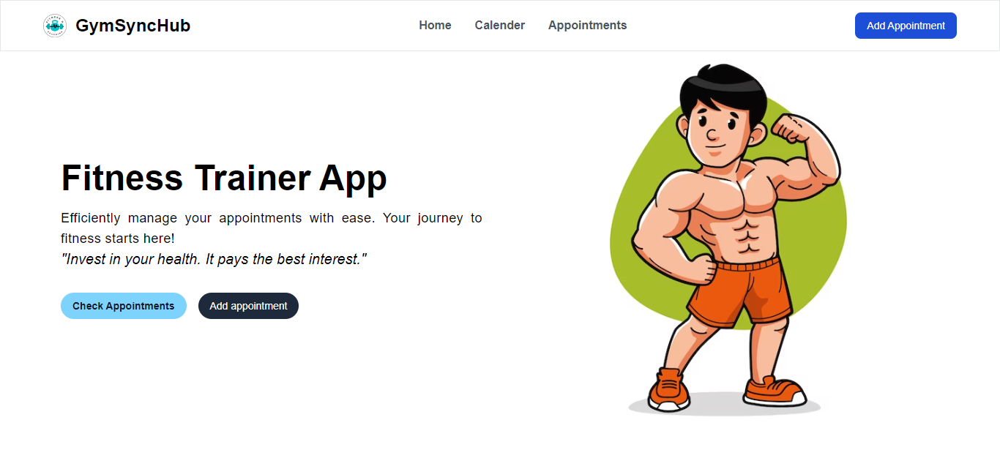
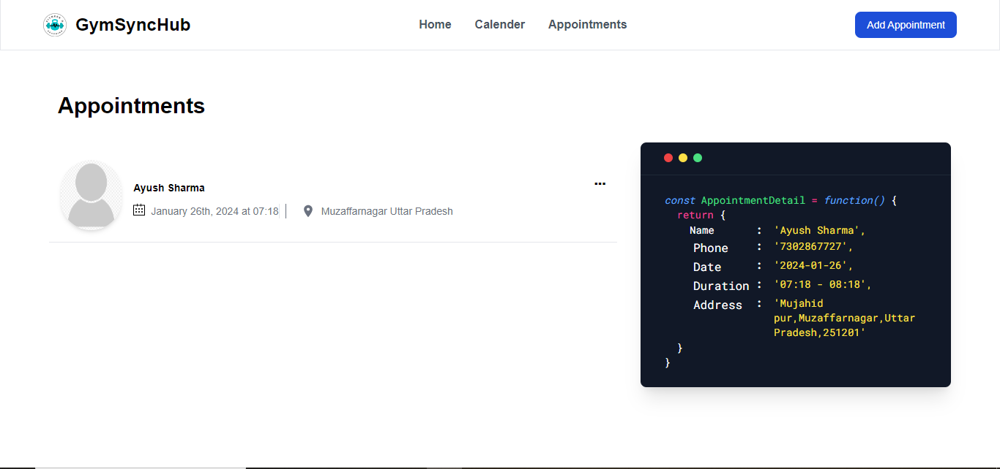
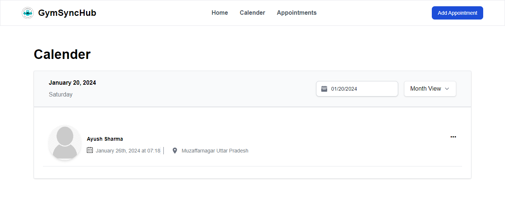

# Fitness Trainer Appointment Management Web Application

## Overview

The Fitness Trainer Appointment Management Web Application is designed to streamline the appointment management process for fitness trainers. The web application provides a user-friendly interface for fitness trainers to efficiently handle client appointments, including adding, editing, and deleting appointments along with client details.

## Key Features

### 1. Appointment Management:
   - **Add Appointments:** Easily add new appointments with relevant details such as client name, date, time, and location.
   - **Edit Appointments:** Modify existing appointments, update client information, or adjust appointment details as needed.
   - **Delete Appointments:** Remove appointments that are canceled or rescheduled.

### 2. Client Details:
   - Maintain a database of client information, including names, contact details, and any other relevant details.

### 3. Calendar View:
   - Implement a calendar view page for fitness trainers to have a comprehensive overview of all their appointments.
   - Easily navigate through dates to see scheduled appointments.

## Home Page


## All Apointments

- To see all detail of appointment click on tht appointment.



## Calender

- **Day View:** Retrieve all the appointments which have on the selected date.
- **Month View:** Retrieve all the appointments which have on the month of selected date.
- **Year View:** Retrieve all the appointments which have on the year of selected date.

- If no appointments in the selected scenario it shows "No Appointments".




## Technologies Used

- **Front-end Framework:** Utilize a front-end framework such as React.js for building a responsive and interactive user interface.
- **State Management:** Implement state management libraries like Redux, Redux-toolkit to efficiently manage the application's state.
- **Styling:** Apply modern styling practices using a CSS preprocessor or utility-first CSS frameworks like Tailwind CSS.
- **Routing:** Use a routing library (e.g., React Router) for navigation between different pages.

## Getting Started

1. **Clone the Repository:**
   ```bash
   git clone https://github.com/Ayush-13-02/Traineer-Appointment-Management.git

2. **Install Dependencies:**
   ```bash
   cd traineer-appointment-management
   npm install

3. **Run application:**
   ```bash
   npm start

## Available Scripts

In the project directory, you can run:

### `npm start`

Runs the app in the development mode.\
Open [http://localhost:3000](http://localhost:3000) to view it in your browser.

The page will reload when you make changes.\
You may also see any lint errors in the console.

### `npm test`

Launches the test runner in the interactive watch mode.\
See the section about [running tests](https://facebook.github.io/create-react-app/docs/running-tests) for more information.

### `npm run build`

Builds the app for production to the `build` folder.\
It correctly bundles React in production mode and optimizes the build for the best performance.

The build is minified and the filenames include the hashes.\
Your app is ready to be deployed!

See the section about [deployment](https://facebook.github.io/create-react-app/docs/deployment) for more information.

### `npm run eject`

**Note: this is a one-way operation. Once you `eject`, you can't go back!**

If you aren't satisfied with the build tool and configuration choices, you can `eject` at any time. This command will remove the single build dependency from your project.

Instead, it will copy all the configuration files and the transitive dependencies (webpack, Babel, ESLint, etc) right into your project so you have full control over them. All of the commands except `eject` will still work, but they will point to the copied scripts so you can tweak them. At this point you're on your own.

You don't have to ever use `eject`. The curated feature set is suitable for small and middle deployments, and you shouldn't feel obligated to use this feature. However we understand that this tool wouldn't be useful if you couldn't customize it when you are ready for it.

